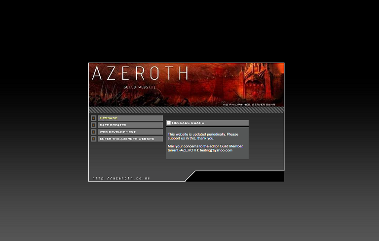

## guildsite-azeroth

> This is a backup and archive of the (Mobiusgames) Mu Philippine's **Azeroth** guild website, as it was last seen on webs.com (freewebs.com) before it was deactivated. I'm uploading it in public for future references, and maybe get to update the site to use modern web design and layout techniques if time permits.
>
> **NOTE:** The original site uses static files and outdated HTML/JS approaches. Some functionality on various pages may not work on modern browsers. Some links may lead to 404 not found pages because some of the original static html files are missing.

## Demo

https://github.com/muonlineph/guildsite-azeroth/public

### Content

- [Demo](#demo)
- [Content](#content)
- [Dependencies](#dependencies)
- [Installation](#installation)
- [Usage](#usage)
- [Credits](#credits)

### Dependencies

This project has no dependencies since it only contains static website files. Other local web servers that allow the hosting of static files are alternate options for local host development.

- (Optional) Docker 
   Required to run a Dockerized Node web server for local development

## Installation

1. Clone this repository.
`https://github.com/muonlineph/guildsite-azeroth.git` 

2. Pull the local web server image (this requires Docker installed). 
`docker pull weaponsforge/livereload-basic:latest`

## Usage

1. Navigate to the project root directory using a terminal, then run the local web server. 
`docker run -it --rm -p 3000:3000 -v %cd%\public:/opt/app/public -e IS_DOCKER=true -e USE_POLLING=true weaponsforge/livereload-basic:latest`

2. Load the localhost website at: 
`http://localhost:3000`

3.  Edit the existing static files from the **./public** directory and wait for live reload. Your updates will reflect on the web browser.

4. To include new static website files on live reload:
	- Create new static (.html, .js, .css) files inside the **./public** directory.

## Credits

Many thanks to GM Ethan for writing most of the site's content and for guild members' active participation in-game and on-site.

@weaponsforge 
20211108 
20241006
